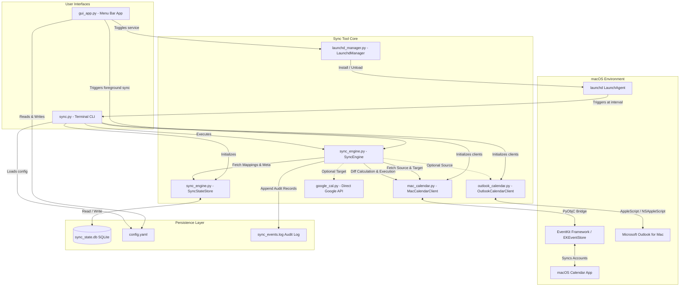

# Technical Architecture & Internal Design

This document details the internal design, component relationships, data lifecycle, and algorithms used in the **Mac Calendar to Gmail (In-App) Sync Tool**.

---

## 1. System Architecture Diagram



---

## 2. Core Modules & Responsibilities

### 2.1 `mac_calendar.py` (`MacCalendarClient`)
- **Native EventKit Interface**: Interacts with macOS's native `EKEventStore` via PyObjC bindings (`pyobjc-framework-EventKit`).
- **Calendar Resolution**: Uses strict Apple `calendarIdentifier` strings to identify calendars uniquely across accounts (Exchange, iCloud, Google, CalDAV).
- **Date Conversion**: Bridges Objective-C `NSDate` and Python `datetime.datetime` using machine local time and UNIX epoch timestamps.
- **Time Window Chunking**: To avoid memory bottlenecks or timeouts with large event datasets, event queries are executed in 90-day intervals.
- **Sanitization on Write**: When creating target events, only `title`, `startDate`, `endDate`, and `isAllDay` are copied. Fields such as `notes`, `location`, `url`, `attendees`, and `alarms` are explicitly stripped.

### 2.2 `outlook_calendar.py` (`OutlookCalendarClient`)
- **Direct Outlook Integration**: Interfaces with the local Microsoft Outlook desktop client using AppleScript and `NSAppleScript` bindings.
- **Recurrence Rule Expansion**: Expands recurring series into individual instances using `dateutil.rrule`.
- **Local Timezone Normalization**: Formats all timestamps in machine local time (`tz.tzlocal()`).

### 2.3 `sync_engine.py` (`SyncEngine` & `SyncStateStore`)
- **`SyncStateStore`**: A light, resilient SQLite database (`sync_state.db`) maintaining event correlation and metadata:
  ```sql
  CREATE TABLE event_mappings (
      source_event_id TEXT PRIMARY KEY,
      target_event_id TEXT NOT NULL,
      content_hash TEXT NOT NULL,
      start_time TEXT,
      end_time TEXT,
      last_synced_at TEXT NOT NULL
  );

  CREATE TABLE sync_meta (
      key TEXT PRIMARY KEY,
      value TEXT NOT NULL
  );
  ```
- **Content Hashing**: Generates a canonical SHA-256 hash of `{title, start, end, is_all_day}` to detect changes without inspecting target calendar contents.
- **Diff Computation**:
  1. Identifies source events not yet present in `event_mappings` $\rightarrow$ **Mark for creation**.
  2. Identifies mapped events whose content hash has changed or whose target event was deleted $\rightarrow$ **Mark for update / re-creation**.
  3. Identifies mappings whose source event no longer falls within the active window $\rightarrow$ **Mark for deletion**.
  4. Identifies unchanged mappings $\rightarrow$ **Preserve without I/O**.

### 2.4 `gui_app.py` (`CalendarSyncApp`)
- **Native Menu Bar Interface**: High-performance Cocoa interface with dark/light mode vibrancy (`NSVisualEffectView`).
- **Dynamic Status**: Reflects real-time sync state in the menu bar with animated SF Symbols.
- **Live Activity Console**: Interactive log viewer with real-time text filtering, syntax highlighting, and auto-scroll.
- **Background Scheduler**: Internal timer and LaunchAgent manager to control background execution.

### 2.5 `launchd_manager.py` (`LaunchdManager`)
- **macOS Service Integration**: Generates and manages the LaunchAgent property list (`com.sendtogmail.calendar-sync.plist`) under `~/Library/LaunchAgents/`.
- **Process Orchestration**: Manages `launchctl bootstrap` / `launchctl bootout` lifecycle, environment variable propagation, and standard I/O log redirects (`sync.log` and `sync.error.log`).

### 2.6 `sync.py`
- **CLI & Dispatcher**: Rich terminal UI interface providing interactive wizards, dry-run previews, bulk event dumps, search capabilities, target calendar resets, and continuous daemon execution.

---

## 3. Recurring Event Instance Expansion

In EventKit, recurring event series share a single base `eventIdentifier`. When a client requests events within a date range:
1. EventKit expands occurrences into discrete event instances.
2. The sync client generates a compound instance identifier:
   $$\text{unique\_instance\_id} = \text{base\_id} + \text{"\_"} + \text{start\_timestamp}$$
3. This allows individual instances (including modified single instances in a series) to map directly to unique target events without colliding with other occurrences in the recurring rule.

---

## 4. Error Handling & Recovery

| Failure Scenario | Mitigation |
|---|---|
| **Target Event Manually Deleted** | `SyncEngine` verifies `event_exists(target_id)`. If missing, it drops the stale mapping and re-creates the event. |
| **System Permission Revocation** | `MacCalendarClient` and `OutlookCalendarClient` check authorization prior to every query and raise descriptive errors (`-1743` automation guidance). |
| **Database Corruption / Loss** | Running `sync.py --reset-state` or `sync.py --clear-target -y` resets the local mapping cleanly. |
| **Network / Sync Delay in CalApp** | Changes made in EventKit are committed immediately to local store (`commit()`); macOS handles background synchronization upstream to Google/Exchange servers. |

---

## 5. Architectural Decision Records (ADRs)

Key architectural decisions are documented in [`docs/adr/`](file:///Users/ap-wayne.tan/DockerProjects/SendtoGMAIL/docs/adr/):
- [ADR 0001: Local EventKit and AppleScript Over Remote Cloud OAuth APIs](file:///Users/ap-wayne.tan/DockerProjects/SendtoGMAIL/docs/adr/0001-local-eventkit-and-applescript-over-cloud-apis.md)
- [ADR 0002: SQLite State Store and SHA-256 Fingerprinting for Idempotent Diffing](file:///Users/ap-wayne.tan/DockerProjects/SendtoGMAIL/docs/adr/0002-sqlite-state-store-and-sha256-fingerprinting.md)
- [ADR 0003: Native Cocoa/PyObjC Menu Bar Application Over Web/Electron Shells](file:///Users/ap-wayne.tan/DockerProjects/SendtoGMAIL/docs/adr/0003-native-pyobjc-menubar-gui.md)
