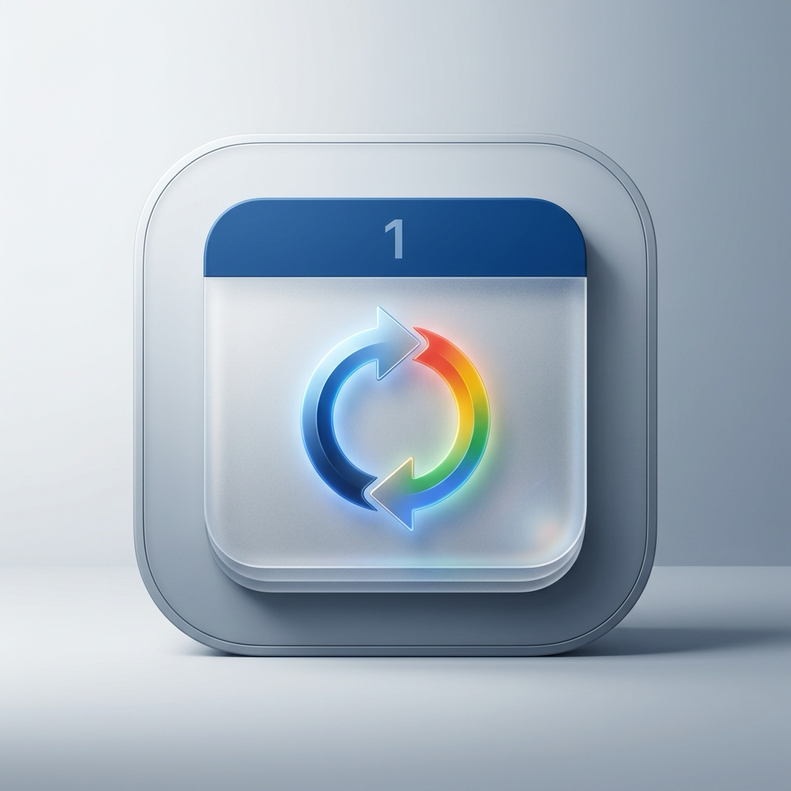

# CalendarSync 📅🔄

<p align="center">
  
</p>

<p align="center">
  <strong>Privacy-First macOS Calendar Mirroring (Work to Personal)</strong><br>
  <em>Mirror work, Exchange, iCloud, and Microsoft Outlook calendars to Google Calendar with zero corporate data leaks.</em>
</p>

<p align="center">
  <a href="https://www.apple.com/macos/"></a>
  <a href="https://www.python.org/"></a>
  <a href="https://github.com/Way-Neh/CopyMyCalendar/releases"></a>
  <a href="LICENSE"></a>
  <a href="https://diataxis.fr/"></a>
</p>

---

## 💡 Why CalendarSync?

Managing two separate lives across a corporate work calendar (Exchange, Outlook, iCloud) and a personal Google Calendar is painful:
- **Cloud sync SaaS tools require full OAuth credentials**, uploading sensitive corporate meeting agendas, attendee emails, and confidential Zoom/Teams links to third-party servers.
- **Manual invites and double-booking** lead to scheduling collisions or missed personal commitments.
- **Sharing full calendar details** violates corporate NDA and workplace security compliance policies.

**CalendarSync solves this entirely on your Mac.** Using macOS EventKit and AppleScript, it reads your work schedule and mirrors time blocks directly into your personal Google Calendar account configured in the macOS Calendar app—**stripping all meeting notes, descriptions, attendee lists, and conferencing links**.

Your personal calendar stays updated with your availability, while your company's data never leaves your computer.

---

## 🔒 The Privacy Invariant

| Field | Source Event (Work/Outlook) | Target Event (Personal Google Cal) | Status |
| :--- | :--- | :--- | :--- |
| **Start & End Time** | `2026-10-15 14:00 - 15:00` | `2026-10-15 14:00 - 15:00` | ✅ **Synced** |
| **Event Title** | `Q4 Board Strategy Review` | `Q4 Board Strategy Review` (or `Busy`) | ✅ **Synced** |
| **All-Day Flag** | `False` | `False` | ✅ **Synced** |
| **Meeting Notes / Body** | Confidential minutes, financials | *Completely Stripped / None* | 🛡️ **BLOCKED** |
| **Attendee List** | CEO, CFO, external partners | *Completely Stripped / None* | 🛡️ **BLOCKED** |
| **Zoom / Teams / Links** | `https://teams.microsoft.com/...` | *Completely Stripped / None* | 🛡️ **BLOCKED** |
| **Locations / Alarms** | Boardroom 4B / custom alarms | *Completely Stripped / None* | 🛡️ **BLOCKED** |

---

## ✨ Features

- **🍏 Native macOS Menu Bar UI**: Sleek Apple HIG System Settings card-style interface with native vibrancy, SF Symbols, dynamic status badges, and real-time live logs.
- **🔒 100% Local & Zero-Cloud**: No third-party servers, no telemetry, no cloud tokens. Direct in-memory sync via Apple EventKit and AppleScript.
- **🏢 Microsoft Outlook & Exchange Support**: Seamlessly extracts events directly from Microsoft Outlook for Mac using native AppleEvents, even when IT disables calendar export.
- **⚡ Smart SHA-256 Diff Engine**: Tracks unique `calendarIdentifier` fingerprints and state in a local SQLite database (`sync_state.db`). Only changes are updated—preventing duplicate events and rate limits.
- **🔁 Complex Recurrence Expansion**: Automatically expands recurring master rules into discrete time instances across a configurable rolling window (e.g. 7 days past, 30 days future).
- **⏱️ Automated Background Sync**: Built-in non-blocking background scheduler with configurable sync intervals (5m to 120m) and optional Start-at-Login (`launchd`) automation.

---

## 📥 Download & Quick Start

### Option 1: Standalone macOS App (Recommended)

1. Download the latest **`CalendarSync-v2.0.0-macOS.dmg`** from [GitHub Releases](https://github.com/Way-Neh/CopyMyCalendar/releases).
2. Open the `.dmg` and drag **`CalendarSync.app`** into your **`Applications`** folder.
3. Launch **CalendarSync** from Spotlight or Applications.
4. Click the CalendarSync icon in your Menu Bar, select your **Source Calendar** (Work/Outlook) and **Target Calendar** (Google/Gmail), and click **Save Settings**!

> [!TIP]
> **First-Time macOS Gatekeeper Notice:**  
> Because CalendarSync is an independent open-source tool without an Apple Developer subscription, macOS may ask to confirm before opening.  
> Simply **Right-Click `CalendarSync.app` → Open**, or run:
> ```bash
> xattr -cr /Applications/CalendarSync.app
> ```

---

### Option 2: CLI & Developer Setup

For developers wanting to run from source or automate via Terminal:

```bash
# Clone the repository
git clone https://github.com/Way-Neh/CopyMyCalendar.git
cd CopyMyCalendar

# Set up Python virtual environment
python3 -m venv venv
source venv/bin/activate
pip install -r requirements.txt

# Launch Menu Bar GUI
python3 gui_app.py

# Or run interactive CLI setup
python3 sync.py setup

# Run a safe dry-run preview
python3 sync.py sync --dry-run

# Run full sync
python3 sync.py sync
```

---

## 🧭 Documentation (Diátaxis Framework)

Complete documentation is available in [`docs/`](docs/):

| 🎓 **Tutorials** (Learning-Oriented) | 🛠️ **How-To Guides** (Task-Oriented) |
|---|---|
| • [**Getting Started with CalendarSync**](docs/tutorials/getting-started.md)<br>_Step-by-step onboarding walkthrough._ | • [**Using the Menu Bar App**](docs/how-to/how-to-use-gui-app.md)<br>_Run and configure the macOS status item._<br>• [**Syncing Microsoft Outlook**](docs/how-to/how-to-sync-outlook.md)<br>_Direct AppleScript bridge for Outlook._<br>• [**Background Sync Automation**](docs/how-to/how-to-setup-background-sync.md)<br>_Automate sync via native launchd._<br>• [**Troubleshooting & Auditing**](docs/how-to/how-to-troubleshoot-and-audit.md)<br>_Inspect mappings and diagnose permissions._<br>• [**Clean & Re-sync**](docs/how-to/how-to-clean-and-resync.md)<br>_Safely wipe target calendar and rebuild state._ |
| 💡 **Explanation** (Understanding-Oriented) | 📖 **Reference** (Information-Oriented) |
| • [**Architecture & Data Flow**](docs/explanation/architecture-and-data-flow.md)<br>_System design and EventKit bridge._<br>• [**Privacy & Sanitization Model**](docs/explanation/privacy-model.md)<br>_Strict data leak prevention._<br>• [**Diff Engine & Recurrence Algorithm**](docs/explanation/diff-and-recurrence-algorithm.md)<br>_SHA-256 fingerprinting and series expansion._<br>• [**Architecture Decision Records (ADRs)**](docs/adr/)<br>_Core architectural trade-offs._ | • [**CLI Reference**](docs/reference/cli-reference.md)<br>_Complete command-line parameters._<br>• [**Configuration Reference (`config.yaml`)**](docs/reference/configuration-reference.md)<br>_Schema, parameters, and defaults._<br>• [**SQLite Database Schema**](docs/reference/database-schema.md)<br>_State store table structures._<br>• [**Python API Reference**](docs/reference/api-reference.md)<br>_Classes, methods, and interfaces._ |

---

## 🛠️ Building from Source

To package the standalone `.app` and `.dmg` distribution on macOS:

```bash
chmod +x scripts/build_macos.sh
./scripts/build_macos.sh
```

The output bundle and DMG installer will be created in `dist/`:
- `dist/CalendarSync.app`
- `dist/CalendarSync-v2.0.0-macOS.dmg`

---

## 🧪 Testing

```bash
# Core sync diff engine tests
python3 test_sync_engine.py

# Outlook AppleScript bridge tests
python3 test_outlook_calendar.py

# GUI Menu Bar application tests
python3 test_gui_app.py
```

---

## 📄 License

This project is licensed under the [MIT License](LICENSE).
