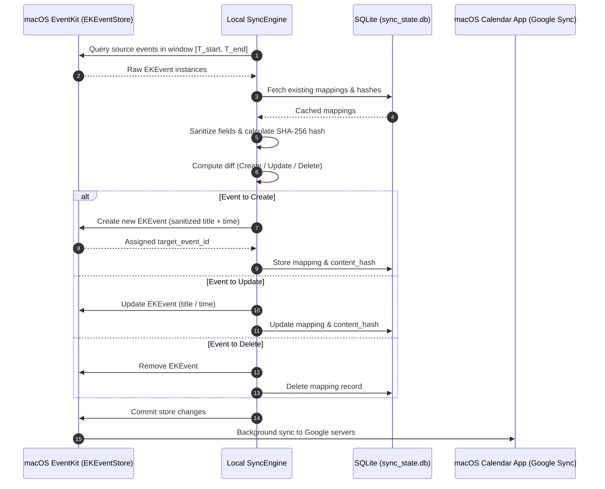

# Explanation: Architecture & Data Flow

This document explains the conceptual architecture and design rationale behind the in-app macOS Calendar synchronization model.

---

## 1. Why In-App EventKit Syncing?

Standard cloud-to-cloud calendar synchronizers typically require:
- Granting full read/write OAuth tokens to external SaaS cloud servers.
- Exposing webhooks or continuous long-polling connections.
- Risking corporate compliance violations by sending sensitive enterprise calendar data to third-party servers.

The **In-App EventKit** approach takes advantage of macOS as the bridge:
1. macOS Calendar already natively connects to your enterprise account (Exchange, Outlook, iCloud) via system-level enterprise SSO and MDM policies.
2. macOS Calendar also natively connects to your personal Google / Gmail account.
3. This sync tool operates **100% locally** on your Mac via Apple's native `EventKit` framework. No network credentials, passwords, or tokens are ever handled by the sync script, and no data leaves your machine except through Apple's trusted system sync daemons.

---

## 2. High-Level Data Flow

---

## 3. Lifetime & Concurrency

- **Stateless Execution**: The core sync engine runs as a single discrete process per execution. State is strictly persisted to SQLite.
- **Atomic Commits**: Event modifications use `saveEvent:span:commit:error:` or explicit batch `commit:`, ensuring the macOS calendar database remains consistent even if interrupted.
- **Process Isolation**: When managed by `launchd`, each sync iteration runs in a sandboxed, non-interactive background process with isolated UTF-8 environment settings.
